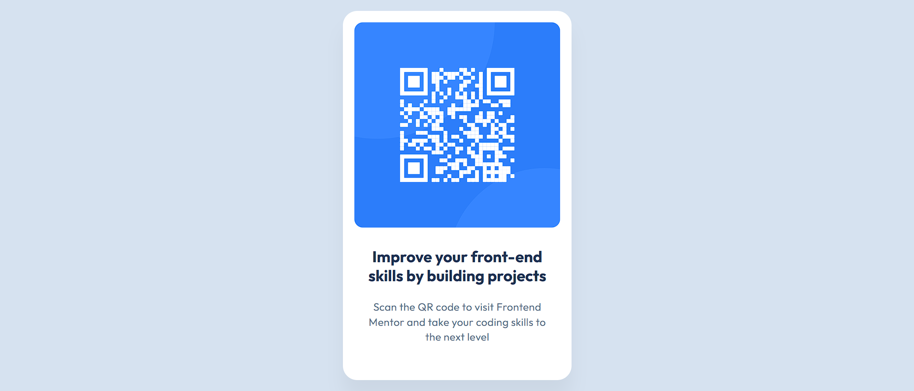

# Frontend Mentor - QR code component solution

This is a solution to the [QR code component challenge on Frontend Mentor](https://www.frontendmentor.io/challenges/qr-code-component-iux_sIO_H). Frontend Mentor challenges help you improve your coding skills by building realistic projects. 

## Table of contents

- [Overview](#overview)
  - [Screenshot](#screenshot)
  - [Links](#links)
- [My process](#my-process)
  - [Built with](#built-with)
  - [What I learned](#what-i-learned)
  - [Continued development](#continued-development)
  - [Useful resources](#useful-resources)
  - [AI Collaboration](#ai-collaboration)
- [Author](#author)
- [Acknowledgments](#acknowledgments)

## Overview

### Screenshot

### Links

- Solution URL: [Add solution URL here](https://www.frontendmentor.io/solutions/semantic-html5-markup-and-css-custom-properties-and-flexbox-0y2MrWvxra)
- Live Site URL: [Add live site URL here](https://nqbinh98.github.io/qr-code-component/)

## My process

### Built with

- Semantic HTML5 markup
- CSS custom properties
- Flexbox
- CSS Grid
- Mobile-first workflow

### What I learned

In this project, I focused on mastering the Flexbox layout to center elements perfectly within the viewport. I also learned how to handle typography scales and use max-width to ensure the component is responsive across different screen sizes without breaking the design.

Specifically, I improved my use of semantic HTML by using an <h1> for the main title to enhance SEO and accessibility.

### Continued development

In future projects, I want to continue focusing on:
- Exploring CSS Grid for more complex dashboard layouts.
- Refining my Mobile-first approach to handle even more breakpoints.
- Improving web performance by optimizing asset loading (images and fonts).

### AI Collaboration

During this challenge, I collaborated with Gemini to:
- Refine the UI: Adjusted line-height, border-radius, and box-shadow to match the original design more precisely.
- Code Optimization: Switched from multiple 
 tags to a more semantic <h1> and 
 structure.
- Troubleshooting: Resolved SSH authentication issues (Permission denied (publickey)) when pushing the code to GitHub.

## Author

- Frontend Mentor - [@nqbinh98](https://www.https://www.frontendmentor.io/profile/nqbinh98)
- Github - [@nqbinh98](https://github.com/nqbinh98)
